# 🏗️ Patient Management System - Visual Architecture Guide

## 📋 Navigation

1. [🏛️ System Overview](#-system-overview)
2. [🔧 Service Architecture](#-service-architecture)
3. [🌐 Communication Flows](#-communication-flows)
4. [☁️ Infrastructure Topology](#️-infrastructure-topology)
5. [📊 Data Flows](#-data-flows)
6. [🔐 Security Layers](#-security-layers)
7. [🚀 Deployment Pipeline](#-deployment-pipeline)
8. [📈 Monitoring Dashboard](#-monitoring-dashboard)

---

## 🏛️ System Overview

### High-Level Architecture

```mermaid
graph TB
    subgraph "🌐 Client Layer"
        Client[👤 Client Apps]
        WebUI[🌐 Web Interface]
        Mobile[📱 Mobile Apps]
    end

    subgraph "🚪 Gateway Layer"
        ALB[⚖️ Load Balancer]
        Gateway[🚪 API Gateway<br/>:4004]
    end

    subgraph "⚙️ Microservices"
        Auth[🔐 Auth<br/>:4005]
        Patient[👥 Patient<br/>:4000]
        Billing[💰 Billing<br/>:4001/:9001]
        Analytics[📊 Analytics<br/>:4002]
    end

    subgraph "💾 Data Layer"
        AuthDB[(🗄️ Auth DB)]
        PatientDB[(🗄️ Patient DB)]
        Kafka[📨 Kafka Stream]
    end

    subgraph "☁️ Infrastructure"
        ECS[☁️ ECS Fargate]
        VPC[🌐 VPC Network]
        Secrets[🔐 Secrets]
        Logs[📋 CloudWatch]
    end

    Client --> ALB
    WebUI --> ALB
    Mobile --> ALB
    ALB --> Gateway
    
    Gateway --> Auth
    Gateway --> Patient
    
    Patient -.->|gRPC| Billing
    Patient -.->|Events| Kafka
    Analytics -.->|Consume| Kafka
    
    Auth --> AuthDB
    Patient --> PatientDB
    
    Auth -.-> Secrets
    Patient -.-> Secrets
    
    Gateway -.-> Logs
    Auth -.-> Logs
    Patient -.-> Logs
    Billing -.-> Logs
    Analytics -.-> Logs
```

### Architecture Principles

```mermaid
mindmap
  root((🏗️ Microservices))
    🎯 Single Responsibility
      One domain per service
      Clear boundaries
      Independent deployment
    🔗 Loose Coupling
      API-first design
      Event-driven
      Service independence
    🧩 High Cohesion
      Related functionality
      Domain-driven
      Clear boundaries
    💾 Database per Service
      Data isolation
      Schema independence
      Technology freedom
    🛡️ Resilience
      Circuit breakers
      Fault tolerance
      Graceful degradation
```

---

## 🔧 Service Architecture

### 🔐 Auth Service

```mermaid
graph TB
    subgraph "🔐 Auth Service (:4005)"
        API[🔌 REST API<br/>/login, /validate]
        Logic[🧠 Auth Logic]
        JWT[🎫 JWT Generator]
        Hash[🔒 BCrypt Hasher]
    end
    
    subgraph "💾 Auth Database"
        Users[(👤 users<br/>id, email, password, role)]
    end
    
    Client[👤 Client] --> API
    API --> Logic
    Logic --> JWT
    Logic --> Hash
    Logic --> Users
    
    API -.->|🎫 JWT Token| Client
    
    style API fill:#e1f5fe
    style JWT fill:#f3e5f5
    style Hash fill:#fff3e0
    style Users fill:#e8f5e8
```

### 👥 Patient Service

```mermaid
graph TB
    subgraph "👥 Patient Service (:4000)"
        API[🔌 REST API<br/>CRUD /patients]
        Logic[🧠 Business Logic]
        Validator[✅ Data Validator<br/>@NotBlank, @Size]
        gRPC[📡 gRPC Client]
        Kafka[📨 Kafka Producer]
    end
    
    subgraph "💾 Patient Database"
        Patients[(👥 patients<br/>id, name, email, address, dob)]
    end
    
    subgraph "🔗 External Services"
        BillingGRPC[💰 Billing gRPC<br/>:9001]
        KafkaTopic[📨 Topic: patient]
    end
    
    Client[👤 Client] --> API
    API --> Validator
    Validator --> Logic
    Logic --> Patients
    Logic --> gRPC
    Logic --> Kafka
    
    gRPC --> BillingGRPC
    Kafka --> KafkaTopic
    
    style API fill:#e8f5e8
    style Validator fill:#fff3e0
    style gRPC fill:#f3e5f5
    style Kafka fill:#e1f5fe
```

### 💰 Billing Service


### 📊 Analytics Service

```mermaid
graph TB
    subgraph "📊 Analytics Service (:4002)"
        Consumer[📨 Kafka Consumer<br/>Group: analytics-service]
        Processor[⚡ Event Processor]
        Engine[📊 Analytics Engine]
    end
    
    subgraph "📨 Event Stream"
        Topic[📨 Kafka Topic: patient]
        Events[📋 PatientEvent<br/>patientId, name, email, event_type]
    end
    
    Topic --> Consumer
    Consumer --> Processor
    Processor --> Engine
    
    Events -.-> Consumer
    
    style Consumer fill:#e1f5fe
    style Processor fill:#f3e5f5
    style Engine fill:#e8f5e8
```

### 🚪 API Gateway

```mermaid
graph TB
    subgraph "🚪 API Gateway (:4004)"
        LB[⚖️ Load Balancer]
        Router[🗺️ Route Manager]
        JWT[🔐 JWT Validator]
        RateLimit[🚦 Rate Limiter]
    end
    
    subgraph "🛣️ Routes"
        AuthRoute[🔐 /auth/** → Auth:4005]
        PatientRoute[👥 /api/patients/** → Patient:4000]
    end
    
    Client[👤 Client] --> LB
    LB --> JWT
    JWT --> RateLimit
    RateLimit --> Router
    
    Router --> AuthRoute
    Router --> PatientRoute
    
    AuthRoute --> AuthService[🔐 Auth Service]
    PatientRoute --> PatientService[👥 Patient Service]
    
    style LB fill:#e1f5fe
    style JWT fill:#f3e5f5
    style Router fill:#e8f5e8
    style RateLimit fill:#fff3e0
```

---

## 🌐 Communication Flows

### Service Communication Map

```mermaid
graph TB
    subgraph "🔄 Synchronous"
        Client[👤 Client]
        Gateway[🚪 Gateway]
        Auth[🔐 Auth]
        Patient[👥 Patient]
        Billing[💰 Billing]
    end
    
    subgraph "⚡ Asynchronous"
        Kafka[📨 Kafka]
        Analytics[📊 Analytics]
    end
    
    Client -->|REST/JSON| Gateway
    Gateway -->|REST/JSON| Auth
    Gateway -->|REST/JSON| Patient
    Patient -->|gRPC/Protobuf| Billing
    Patient -->|Kafka/Protobuf| Kafka
    Kafka -->|Stream| Analytics
    
    style Client fill:#e3f2fd
    style Gateway fill:#f3e5f5
    style Auth fill:#e8f5e8
    style Patient fill:#fff3e0
    style Billing fill:#fce4ec
    style Kafka fill:#e1f5fe
    style Analytics fill:#f1f8e9
```

### 🔄 Patient Creation Flow


### 🔐 Authentication Flow


### 📊 Event-Driven Flow

```mermaid
graph LR
    subgraph "📤 Producers"
        P[👥 Patient Service]
    end
    
    subgraph "📨 Event Stream"
        K[📨 Kafka<br/>Topic: patient]
    end
    
    subgraph "📥 Consumers"
        A[📊 Analytics Service]
    end
    
    subgraph "📋 Event Types"
        CREATE[📝 CREATE]
        UPDATE[✏️ UPDATE]
        DELETE[🗑️ DELETE]
    end
    
    P -->|Publish| K
    K -->|Subscribe| A
    
    CREATE -.-> K
    UPDATE -.-> K
    DELETE -.-> K
    
    style P fill:#e8f5e8
    style K fill:#e1f5fe
    style A fill:#f1f8e9
    style CREATE fill:#c8e6c9
    style UPDATE fill:#fff3e0
    style DELETE fill:#ffcdd2
```

---

## ☁️ Infrastructure Topology

### AWS Infrastructure Overview

```mermaid
graph TB
    subgraph "🌐 Internet"
        Users[👥 Users]
        IGW[🌐 Internet Gateway]
    end
    
    subgraph "🏗️ VPC - Patient Management"
        subgraph "🌍 Public Subnets (2 AZs)"
            ALB[⚖️ Application LB]
            NAT1[🔄 NAT Gateway AZ-1]
            NAT2[🔄 NAT Gateway AZ-2]
        end
        
        subgraph "🔒 Private Subnets (2 AZs)"
            subgraph "☁️ ECS Fargate"
                Gateway[🚪 Gateway]
                Auth[🔐 Auth]
                Patient[👥 Patient]
                Billing[💰 Billing]
                Analytics[📊 Analytics]
            end
            
            subgraph "💾 Data Layer"
                RDS1[(🗄️ Auth DB)]
                RDS2[(🗄️ Patient DB)]
                MSK[📨 Kafka Cluster]
            end
        end
    end
    
    subgraph "🛠️ AWS Services"
        Secrets[🔐 Secrets Manager]
        Logs[📋 CloudWatch]
        Metrics[📊 Metrics]
    end
    
    Users --> IGW
    IGW --> ALB
    ALB --> Gateway
    
    Gateway --> Auth
    Gateway --> Patient
    Patient -.-> Billing
    Patient -.-> MSK
    MSK -.-> Analytics
    
    Auth --> RDS1
    Patient --> RDS2
    
    Auth -.-> Secrets
    Patient -.-> Secrets
    
    Gateway -.-> Logs
    Auth -.-> Logs
    Patient -.-> Logs
    
    style Users fill:#e3f2fd
    style ALB fill:#f3e5f5
    style Gateway fill:#e8f5e8
    style MSK fill:#e1f5fe
    style Secrets fill:#fff3e0
```

### 🐳 Container Architecture

```mermaid
graph TB
    subgraph "☁️ ECS Fargate Cluster"
        subgraph "🚪 Gateway Task"
            GW[🚪 Gateway<br/>256 CPU / 512 MB<br/>:4004]
        end
        
        subgraph "🔐 Auth Task"
            Auth[🔐 Auth<br/>256 CPU / 512 MB<br/>:4005]
        end
        
        subgraph "👥 Patient Task"
            Patient[👥 Patient<br/>256 CPU / 512 MB<br/>:4000]
        end
        
        subgraph "💰 Billing Task"
            Billing[💰 Billing<br/>256 CPU / 512 MB<br/>:4001/:9001]
        end
        
        subgraph "📊 Analytics Task"
            Analytics[📊 Analytics<br/>256 CPU / 512 MB<br/>:4002]
        end
    end
    
    subgraph "🗺️ Service Discovery"
        CloudMap[🗺️ CloudMap<br/>patient-management.local]
    end
    
    subgraph "🎯 Load Balancing"
        TargetGroups[🎯 Target Groups<br/>Health: 60s]
    end
    
    GW -.-> CloudMap
    Auth -.-> CloudMap
    Patient -.-> CloudMap
    Billing -.-> CloudMap
    Analytics -.-> CloudMap
    
    CloudMap -.-> TargetGroups
    
    style GW fill:#e8f5e8
    style Auth fill:#f3e5f5
    style Patient fill:#fff3e0
    style Billing fill:#fce4ec
    style Analytics fill:#e1f5fe
```

### 🏠 LocalStack Development

```mermaid
graph TB
    subgraph "💻 Developer Machine"
        subgraph "🏠 LocalStack (:4566)"
            LS_ECS[☁️ ECS Sim]
            LS_RDS[🗄️ RDS Sim]
            LS_MSK[📨 MSK Sim]
            LS_ALB[⚖️ ALB Sim]
        end
        
        subgraph "🐳 Docker Containers"
            Local_GW[🚪 Gateway:4004]
            Local_Auth[🔐 Auth:4005]
            Local_Patient[👥 Patient:4000]
            Local_Billing[💰 Billing:4001/9001]
            Local_Analytics[📊 Analytics:4002]
        end
        
        subgraph "📨 Local Kafka"
            Brokers[📨 Brokers<br/>:4510-4512]
        end
    end
    
    LS_ECS -.-> Local_GW
    LS_ECS -.-> Local_Auth
    LS_ECS -.-> Local_Patient
    LS_ECS -.-> Local_Billing
    LS_ECS -.-> Local_Analytics
    
    LS_MSK -.-> Brokers
    
    Local_Patient -.-> Brokers
    Brokers -.-> Local_Analytics
    
    style LS_ECS fill:#e3f2fd
    style LS_RDS fill:#f1f8e9
    style LS_MSK fill:#e1f5fe
    style Brokers fill:#fff3e0
```

---

## 📊 Data Flows

### Database Schema


### 🔄 Data Processing Pipeline

```mermaid
graph LR
    subgraph "📥 Input"
        API[📥 REST API]
        Validation[✅ Validation]
    end
    
    subgraph "💾 Storage"
        PostgreSQL[(🗄️ PostgreSQL)]
    end
    
    subgraph "⚡ Processing"
        EventGen[📝 Events]
        Kafka[📨 Kafka]
        Consumer[📊 Consumer]
    end
    
    subgraph "🔗 Integration"
        gRPC[📡 gRPC]
        Billing[💰 Billing]
    end
    
    API --> Validation
    Validation --> PostgreSQL
    PostgreSQL --> EventGen
    PostgreSQL --> gRPC
    
    EventGen --> Kafka
    Kafka --> Consumer
    
    gRPC --> Billing
    
    style API fill:#e8f5e8
    style PostgreSQL fill:#e1f5fe
    style Kafka fill:#fff3e0
    style Billing fill:#f3e5f5
```

### 📈 Real-time Analytics

```mermaid
graph TB
    subgraph "📤 Sources"
        Patient[👥 Patient Service]
        Events[📋 Events<br/>CREATE/UPDATE/DELETE]
    end
    
    subgraph "📨 Streaming"
        Topic[📨 Topic: patient]
        Consumer[📊 Consumer<br/>analytics-service]
    end
    
    subgraph "⚡ Processing"
        Parser[🔍 Parser]
        Aggregator[📊 Aggregator]
        Metrics[📈 Metrics]
    end
    
    subgraph "📊 Output"
        Dashboard[📊 Dashboard]
        Alerts[🚨 Alerts]
    end
    
    Patient --> Events
    Events --> Topic
    Topic --> Consumer
    
    Consumer --> Parser
    Parser --> Aggregator
    Aggregator --> Metrics
    
    Metrics --> Dashboard
    Metrics --> Alerts
    
    style Patient fill:#e8f5e8
    style Topic fill:#e1f5fe
    style Consumer fill:#f1f8e9
    style Dashboard fill:#fff3e0
```

### 💾 Database Connection Architecture

```mermaid
graph TB
    subgraph "🔐 Auth Service Database"
        AuthService[🔐 Auth Service]
        AuthPool[🏊 HikariCP Pool<br/>Max: 10 connections]
        AuthDB[(🗄️ auth_db<br/>PostgreSQL 17.2)]
    end
    
    subgraph "👥 Patient Service Database"
        PatientService[👥 Patient Service]
        PatientPool[🏊 HikariCP Pool<br/>Max: 10 connections]
        PatientDB[(🗄️ patient_db<br/>PostgreSQL 17.2)]
    end
    
    subgraph "🔐 Secrets Management"
        Secrets[🗝️ AWS Secrets Manager]
        AuthCreds[🔑 Auth DB Credentials]
        PatientCreds[🔑 Patient DB Credentials]
    end
    
    AuthService --> AuthPool
    AuthPool --> AuthDB
    PatientService --> PatientPool
    PatientPool --> PatientDB
    
    Secrets --> AuthCreds
    Secrets --> PatientCreds
    AuthCreds -.-> AuthService
    PatientCreds -.-> PatientService
    
    style AuthService fill:#f3e5f5
    style PatientService fill:#e8f5e8
    style Secrets fill:#fff3e0
    style AuthDB fill:#e1f5fe
    style PatientDB fill:#e1f5fe
```

### 📊 Data Validation Flow


### 🔄 Event Sourcing Pattern

```mermaid
graph LR
    subgraph "📝 Event Generation"
        PatientCRUD[👥 Patient CRUD]
        EventFactory[🏭 Event Factory]
        EventStore[📚 Event Store<br/>Kafka Topic]
    end
    
    subgraph "📨 Event Processing"
        EventConsumer[📊 Event Consumer]
        EventHandler[⚡ Event Handler]
        StateProjection[📊 State Projection]
    end
    
    subgraph "📋 Event Types"
        PatientCreated[📝 PatientCreated]
        PatientUpdated[✏️ PatientUpdated]
        PatientDeleted[🗑️ PatientDeleted]
        BillingAccountCreated[💰 BillingAccountCreated]
    end
    
    PatientCRUD --> EventFactory
    EventFactory --> EventStore
    EventStore --> EventConsumer
    EventConsumer --> EventHandler
    EventHandler --> StateProjection
    
    EventFactory -.-> PatientCreated
    EventFactory -.-> PatientUpdated
    EventFactory -.-> PatientDeleted
    EventFactory -.-> BillingAccountCreated
    
    style PatientCRUD fill:#e8f5e8
    style EventStore fill:#e1f5fe
    style EventConsumer fill:#f1f8e9
    style PatientCreated fill:#c8e6c9
    style PatientUpdated fill:#fff3e0
    style PatientDeleted fill:#ffcdd2
    style BillingAccountCreated fill:#f3e5f5
```

### 🔍 Data Query Patterns

```mermaid
graph TB
    subgraph "📊 Query Types"
        SimpleQuery[🔍 Simple Queries<br/>Find by ID, Email]
        ComplexQuery[🧮 Complex Queries<br/>Filtering, Pagination]
        AggregateQuery[📈 Aggregate Queries<br/>Count, Statistics]
    end
    
    subgraph "⚡ Performance Optimization"
        Indexing[📇 Database Indexes<br/>email, id fields]
        ConnectionPool[🏊 Connection Pooling<br/>HikariCP]
        QueryCache[💾 Query Caching<br/>JPA L2 Cache]
    end
    
    subgraph "📊 Query Execution"
        JPA[🗃️ JPA Repository]
        NativeSQL[⚡ Native SQL<br/>Complex queries]
        QueryMetrics[📊 Query Metrics<br/>Performance monitoring]
    end
    
    SimpleQuery --> Indexing
    ComplexQuery --> ConnectionPool
    AggregateQuery --> QueryCache
    
    Indexing --> JPA
    ConnectionPool --> NativeSQL
    QueryCache --> QueryMetrics
    
    style SimpleQuery fill:#e8f5e8
    style ComplexQuery fill:#fff3e0
    style AggregateQuery fill:#f3e5f5
    style Indexing fill:#e1f5fe
    style JPA fill:#f1f8e9
```

---

## 🔐 Security Layers

### Defense in Depth

```mermaid
graph TB
    subgraph "🛡️ Security Layers"
        subgraph "🌐 Network"
            IGW[🌐 Internet Gateway<br/>DDoS Protection]
            ALB[⚖️ Load Balancer<br/>SSL Termination]
            VPC[🛡️ VPC<br/>Network Isolation]
            SG[🔒 Security Groups<br/>Firewall Rules]
        end
        
        subgraph "🔐 Application"
            JWT[🎫 JWT Validation<br/>Stateless Auth]
            API[🚪 API Gateway<br/>Rate Limiting]
            Validation[✅ Input Validation<br/>Sanitization]
        end
        
        subgraph "💾 Data"
            Encryption[🔐 Encryption at Rest<br/>Database Security]
            Secrets[🗝️ Secrets Manager<br/>Credential Mgmt]
            BCrypt[🔒 BCrypt Hashing<br/>Password Security]
        end
    end
    
    IGW --> ALB
    ALB --> VPC
    VPC --> SG
    SG --> API
    API --> JWT
    JWT --> Validation
    Validation --> Encryption
    Encryption --> Secrets
    Secrets --> BCrypt
    
    style IGW fill:#ffcdd2
    style ALB fill:#f8bbd9
    style VPC fill:#e1bee7
    style SG fill:#d1c4e9
    style JWT fill:#c5cae9
    style API fill:#bbdefb
    style Validation fill:#b3e5fc
    style Encryption fill:#b2ebf2
    style Secrets fill:#b2dfdb
    style BCrypt fill:#c8e6c9
```

### 🔑 Auth State Machine

```mermaid
stateDiagram-v2
    [*] --> Unauthenticated
    
    Unauthenticated --> LoginAttempt : 🔐 POST /auth/login
    LoginAttempt --> ValidatingCredentials : 🔍 Check credentials
    
    ValidatingCredentials --> AuthFailed : ❌ Invalid
    ValidatingCredentials --> GeneratingJWT : ✅ Valid
    
    AuthFailed --> Unauthenticated : 🔄 Return error
    GeneratingJWT --> Authenticated : 🎫 Return JWT
    
    Authenticated --> MakingRequest : 📡 API call + JWT
    MakingRequest --> ValidatingJWT : 🔐 Validate token
    
    ValidatingJWT --> TokenExpired : ⏰ Expired
    ValidatingJWT --> AuthorizedRequest : ✅ Valid
    
    TokenExpired --> Unauthenticated : 🔄 Re-login
    AuthorizedRequest --> ServiceResponse : ⚡ Process
    ServiceResponse --> Authenticated : 📤 Response
    
    Authenticated --> [*] : 🚪 Logout
```

---

## 🚀 Deployment Pipeline

### CI/CD Flow

```mermaid
graph LR
    subgraph "📁 Source"
        Git[📁 Git Repo]
        PR[🔄 Pull Request]
    end
    
    subgraph "🔨 Build"
        Maven[🔨 Maven]
        Tests[🧪 Tests]
        Docker[🐳 Docker]
    end
    
    subgraph "🏗️ Infrastructure"
        CDK[☁️ AWS CDK]
        CF[📋 CloudFormation]
        LocalStack[🏠 LocalStack]
    end
    
    subgraph "🚀 Deploy"
        ECS[☁️ ECS]
        Health[❤️ Health]
        Monitor[📊 Monitor]
    end
    
    Git --> PR
    PR --> Maven
    Maven --> Tests
    Tests --> Docker
    Docker --> CDK
    CDK --> CF
    CF --> LocalStack
    LocalStack --> ECS
    ECS --> Health
    Health --> Monitor
    
    style Git fill:#e8f5e8
    style Maven fill:#fff3e0
    style Docker fill:#e1f5fe
    style CDK fill:#f3e5f5
    style ECS fill:#f1f8e9
```

### 🏗️ Infrastructure as Code

```mermaid
graph TB
    subgraph "📱 CDK App"
        App[📱 CDK App<br/>Java 21]
        Stack[📚 Stack]
    end
    
    subgraph "☁️ AWS Resources"
        VPC[🌐 VPC]
        ECS[☁️ ECS]
        RDS[🗄️ RDS]
        MSK[📨 MSK]
        ALB[⚖️ ALB]
        Secrets[🔐 Secrets]
        Logs[📋 Logs]
    end
    
    subgraph "🎯 Targets"
        LocalStack[🏠 LocalStack<br/>Dev]
        AWS[☁️ AWS<br/>Prod]
    end
    
    App --> Stack
    Stack --> VPC
    Stack --> ECS
    Stack --> RDS
    Stack --> MSK
    Stack --> ALB
    Stack --> Secrets
    Stack --> Logs
    
    Stack -.-> LocalStack
    Stack -.-> AWS
    
    style App fill:#e8f5e8
    style Stack fill:#fff3e0
    style LocalStack fill:#e1f5fe
    style AWS fill:#f3e5f5
```

### 🔄 Deployment Workflow

```mermaid
sequenceDiagram
    participant Dev as 👨‍💻 Developer
    participant Git as 📁 Git Repo
    participant CI as 🔨 CI Pipeline
    participant CDK as ☁️ CDK
    participant LS as 🏠 LocalStack
    participant ECS as ☁️ ECS

    Dev->>Git: 📤 Push Code
    Git->>CI: 🚀 Trigger Build
    
    rect rgb(255, 245, 238)
        Note over CI: 🔨 Build Phase
        CI->>CI: 🧪 Run Tests
        CI->>CI: 🐳 Build Images
        CI->>CI: 📦 Package Artifacts
    end
    
    rect rgb(232, 245, 233)
        Note over CDK,LS: 🏗️ Infrastructure Phase
        CI->>CDK: 📋 Synthesize Templates
        CDK->>LS: 🚀 Deploy to LocalStack
        LS->>LS: 🏗️ Create Resources
    end
    
    rect rgb(227, 242, 253)
        Note over ECS: 🚀 Deployment Phase
        LS->>ECS: 📦 Deploy Services
        ECS->>ECS: ❤️ Health Checks
        ECS->>Dev: ✅ Deployment Complete
    end
```

### 🐳 Container Build Process

```mermaid
graph TB
    subgraph "🔨 Multi-Stage Build"
        subgraph "📦 Builder Stage"
            Maven_Base[📦 Maven 3.9.9<br/>Eclipse Temurin 21]
            Source[📁 Source Code]
            Dependencies[📚 Dependencies]
            Compile[🔨 Compile]
            Package[📦 Package JAR]
        end
        
        subgraph "🏃 Runtime Stage"
            JRE_Base[🏃 OpenJDK 21<br/>Runtime]
            JAR_Copy[📦 Copy JAR]
            Config[⚙️ Configuration]
            Expose[🔌 Expose Ports]
        end
    end
    
    subgraph "🏷️ Image Registry"
        Images[🐳 Docker Images<br/>- gateway:latest<br/>- auth:latest<br/>- patient:latest<br/>- billing:latest<br/>- analytics:latest]
    end
    
    Maven_Base --> Source
    Source --> Dependencies
    Dependencies --> Compile
    Compile --> Package
    
    Package --> JAR_Copy
    JRE_Base --> JAR_Copy
    JAR_Copy --> Config
    Config --> Expose
    
    Expose --> Images
    
    style Maven_Base fill:#fff3e0
    style JRE_Base fill:#e8f5e8
    style Images fill:#e1f5fe
```

### 🌍 Environment Deployment Strategy

```mermaid
graph TB
    subgraph "🏠 Development"
        Dev_LS[🏠 LocalStack]
        Dev_Docker[🐳 Docker Compose]
        Dev_Services[⚙️ All Services<br/>Single Machine]
    end
    
    subgraph "🧪 Testing"
        Test_AWS[☁️ AWS Test Account]
        Test_ECS[☁️ ECS Fargate]
        Test_RDS[🗄️ RDS Test Instance]
    end
    
    subgraph "🚀 Production"
        Prod_AWS[☁️ AWS Production]
        Prod_ECS[☁️ ECS Auto-Scaling]
        Prod_RDS[🗄️ RDS Multi-AZ]
        Prod_MSK[📨 MSK Production]
    end
    
    Dev_LS --> Dev_Docker
    Dev_Docker --> Dev_Services
    
    Dev_Services -.->|🚀 Promote| Test_AWS
    Test_AWS --> Test_ECS
    Test_ECS --> Test_RDS
    
    Test_RDS -.->|✅ Validated| Prod_AWS
    Prod_AWS --> Prod_ECS
    Prod_ECS --> Prod_RDS
    Prod_RDS --> Prod_MSK
    
    style Dev_LS fill:#e3f2fd
    style Test_AWS fill:#fff3e0
    style Prod_AWS fill:#e8f5e8
```

---

## 📈 Monitoring Dashboard

### 🏥 System Health

```mermaid
graph TB
    subgraph "⚙️ Service Health"
        GW_Health[🚪 Gateway<br/>✅ Healthy]
        Auth_Health[🔐 Auth<br/>✅ Healthy]
        Patient_Health[👥 Patient<br/>✅ Healthy]
        Billing_Health[💰 Billing<br/>✅ Healthy]
        Analytics_Health[📊 Analytics<br/>✅ Healthy]
    end
    
    subgraph "🏗️ Infrastructure Health"
        DB_Health[🗄️ Databases<br/>✅ Connected]
        Kafka_Health[📨 Kafka<br/>✅ Running]
        ALB_Health[⚖️ Load Balancer<br/>✅ Active]
    end
    
    subgraph "📊 Performance"
        Response[⏱️ Response<br/>< 200ms]
        Throughput[📈 Throughput<br/>1,250 req/s]
        Errors[❌ Errors<br/>< 0.1%]
    end
    
    subgraph "💻 Resources"
        CPU[🖥️ CPU<br/>45%]
        Memory[💾 Memory<br/>60%]
        Network[🌐 Network<br/>Normal]
    end
    
    style GW_Health fill:#c8e6c9
    style Auth_Health fill:#c8e6c9
    style Patient_Health fill:#c8e6c9
    style Billing_Health fill:#c8e6c9
    style Analytics_Health fill:#c8e6c9
    style DB_Health fill:#c8e6c9
    style Kafka_Health fill:#c8e6c9
    style ALB_Health fill:#c8e6c9
```

### 📊 Performance Metrics

```mermaid
graph LR
    subgraph "📥 Requests"
        Incoming[📥 Requests<br/>1,250/sec]
        Success[✅ Success<br/>99.9%]
        Errors[❌ Errors<br/>0.1%]
    end
    
    subgraph "⏱️ Latency"
        P50[📊 P50<br/>150ms]
        P95[📊 P95<br/>300ms]
        P99[📊 P99<br/>500ms]
    end
    
    subgraph "⚙️ Service RPS"
        Auth_RPS[🔐 Auth<br/>200/sec]
        Patient_RPS[👥 Patient<br/>800/sec]
        Billing_RPS[💰 Billing<br/>150/sec]
        Analytics_RPS[📊 Analytics<br/>100/sec]
    end
    
    Incoming --> Success
    Incoming --> Errors
    
    Success --> P50
    Success --> P95
    Success --> P99
    
    P50 --> Auth_RPS
    P95 --> Patient_RPS
    P99 --> Billing_RPS
    Analytics_RPS
    
    style Incoming fill:#e3f2fd
    style Success fill:#c8e6c9
    style Errors fill:#ffcdd2
    style P50 fill:#fff3e0
    style P95 fill:#fff3e0
    style P99 fill:#fff3e0
```

---

**🎯 Built with ❤️ by Himanshu Sharma** 