# 🏥 Patient Management System

<div align="center">


**A modern, cloud-native microservices architecture for healthcare patient management**

[Features](#-features) • [Architecture](#-architecture) • [Quick Start](#-quick-start) • [API Documentation](#-api-documentation) • [Contributing](#-contributing)

</div>

---

## 🌟 Overview

The **Patient Management System** is a production-ready, enterprise-grade microservices application built with modern technologies and cloud-native principles. It demonstrates best practices in distributed systems, event-driven architecture, and infrastructure as code.

### 🎯 Key Highlights

- **🏗️ Microservices Architecture** - 5 independent, scalable services
- **🔐 Security-First Design** - JWT authentication with API Gateway
- **📡 Multiple Communication Patterns** - REST, gRPC, and Kafka messaging
- **☁️ Cloud-Native Infrastructure** - AWS services with LocalStack for local development
- **🐳 Containerized Deployment** - Docker with multi-stage builds
- **🧪 Comprehensive Testing** - Unit, integration, and API testing
- **📊 Event-Driven Analytics** - Real-time patient data processing

---

## 🚀 Features

### Core Functionality
- ✅ **Patient Management** - Complete CRUD operations for patient records
- ✅ **Authentication & Authorization** - Secure JWT-based access control
- ✅ **Billing Integration** - Automated billing account creation via gRPC
- ✅ **Real-time Analytics** - Event-driven patient data processing
- ✅ **API Gateway** - Centralized routing and security

### Technical Features
- 🔄 **Event-Driven Architecture** - Kafka-based messaging for loose coupling
- 🌐 **RESTful APIs** - OpenAPI 3.0 documented endpoints
- ⚡ **gRPC Communication** - High-performance inter-service communication
- 🗄️ **Database Per Service** - PostgreSQL databases with proper isolation
- 📈 **Observability** - CloudWatch logging and monitoring
- 🔧 **Infrastructure as Code** - AWS CDK for reproducible deployments

---

## 🏗️ Architecture

### System Overview

```mermaid
graph TB
    Client[👤 Client] --> ALB[🔄 Application Load Balancer]
    ALB --> Gateway[🚪 API Gateway :4004]
    
    Gateway --> Auth[🔐 Auth Service :4005]
    Gateway --> Patient[👥 Patient Service :4000]
    
    Patient --> |gRPC| Billing[💰 Billing Service :4001/9001]
    Patient --> |Kafka| Analytics[📊 Analytics Service :4002]
    
    Auth --> AuthDB[(🗄️ Auth Database)]
    Patient --> PatientDB[(🗄️ Patient Database)]
    
    Patient --> Kafka[📨 Kafka Cluster]
    Analytics --> Kafka
    
    subgraph "AWS Infrastructure"
        ALB
        Gateway
        Auth
        Patient
        Billing
        Analytics
        AuthDB
        PatientDB
        Kafka
    end
```



### Service Architecture

| Service | Port | Technology | Database | Purpose |
|---------|------|------------|----------|---------|
| **API Gateway** | 4004 | Spring Cloud Gateway | - | Request routing & JWT validation |
| **Auth Service** | 4005 | Spring Boot + Security | PostgreSQL | User authentication & JWT management |
| **Patient Service** | 4000 | Spring Boot + JPA | PostgreSQL | Patient CRUD operations |
| **Billing Service** | 4001/9001 | Spring Boot + gRPC | - | Billing account management |
| **Analytics Service** | 4002 | Spring Boot + Kafka | - | Real-time event processing |

### Communication Patterns

1. **🌐 REST API** - Client ↔ API Gateway ↔ Services
2. **⚡ gRPC** - Patient Service ↔ Billing Service
3. **📨 Kafka Events** - Patient Service → Analytics Service

---

## 🛠️ Technology Stack

### Backend Services
- **Java 21** - Modern LTS Java version
- **Spring Boot 3.5.0** - Latest Spring framework
- **Spring Cloud Gateway** - API gateway and routing
- **Spring Security** - Authentication and authorization
- **Spring Data JPA** - Database abstraction layer
- **Spring Kafka** - Event streaming integration

### Communication & Messaging
- **gRPC** - High-performance RPC framework
- **Protocol Buffers** - Efficient serialization
- **Apache Kafka 2.8.0** - Event streaming platform
- **OpenAPI 3.0** - API documentation standard

### Data & Storage
- **PostgreSQL 17.2** - Primary database
- **AWS Secrets Manager** - Credential management
- **Database per Service** - Microservices data isolation

### Infrastructure & Deployment
- **AWS CDK 2.178.1** - Infrastructure as Code
- **LocalStack** - Local AWS simulation
- **Docker** - Containerization platform
- **Amazon ECS Fargate** - Serverless containers
- **Application Load Balancer** - Traffic distribution
- **Amazon VPC** - Network isolation

### Testing & Quality
- **JUnit 5** - Unit testing framework
- **REST Assured** - API testing library
- **Integration Tests** - End-to-end testing
- **Maven** - Build and dependency management

---

## 🚀 Quick Start

### Prerequisites

Before you begin, ensure you have the following installed on your system:

- **Java 21** or higher ([Download here](https://adoptium.net/))
- **Maven 3.9+** ([Installation guide](https://maven.apache.org/install.html))
- **Docker** and Docker Compose ([Get Docker](https://docs.docker.com/get-docker/))
- **Git** for version control
- **LocalStack** for local AWS simulation
- **AWS CLI** configured for LocalStack ([Installation guide](https://docs.aws.amazon.com/cli/latest/userguide/getting-started-install.html))

### 🔧 Environment Setup

#### 1. Verify Prerequisites

```bash
# Check Java version (should be 21+)
java -version

# Check Maven version (should be 3.9+)
mvn -version

# Check Docker version
docker --version
docker-compose --version

# Check AWS CLI
aws --version
```

#### 2. Configure AWS CLI for LocalStack

```bash
# Configure AWS CLI with dummy credentials for LocalStack
aws configure set aws_access_key_id test
aws configure set aws_secret_access_key test
aws configure set default.region us-east-1
aws configure set default.output json
```

### 📥 Installation Steps

#### 1. Clone the Repository

```bash
git clone <repository-url>
cd patient-management
```

#### 2. Build All Services

Build each microservice individually to ensure all dependencies are resolved:

```bash
# Build Auth Service
echo "🔐 Building Auth Service..."
mvn clean package -f auth-service/pom.xml
echo "✅ Auth Service built successfully"

# Build Patient Service
echo "👥 Building Patient Service..."
mvn clean package -f patient-service/pom.xml
echo "✅ Patient Service built successfully"

# Build Billing Service
echo "💰 Building Billing Service..."
mvn clean package -f billing-service/pom.xml
echo "✅ Billing Service built successfully"

# Build Analytics Service
echo "📊 Building Analytics Service..."
mvn clean package -f analytics-service/pom.xml
echo "✅ Analytics Service built successfully"

# Build API Gateway
echo "🚪 Building API Gateway..."
mvn clean package -f api-gateway/pom.xml
echo "✅ API Gateway built successfully"

# Build Infrastructure
echo "🏗️ Building Infrastructure..."
mvn compile -f infrastructure/pom.xml
echo "✅ Infrastructure built successfully"

# Build Integration Tests
echo "🧪 Building Integration Tests..."
mvn compile -f integration-tests/pom.xml
echo "✅ Integration Tests built successfully"
```

#### 3. Build Docker Images

Create Docker images for all services:

```bash
# Build all Docker images
echo "🐳 Building Docker images..."

docker build -t auth-service ./auth-service
echo "✅ Auth Service image built"

docker build -t patient-service ./patient-service
echo "✅ Patient Service image built"

docker build -t billing-service ./billing-service
echo "✅ Billing Service image built"

docker build -t analytics-service ./analytics-service
echo "✅ Analytics Service image built"

docker build -t api-gateway ./api-gateway
echo "✅ API Gateway image built"

echo "🎉 All Docker images built successfully!"
```

#### 4. Start LocalStack

Start LocalStack to simulate AWS services locally:

```bash
# Start LocalStack with required services
echo "🚀 Starting LocalStack..."
docker run --rm -d \
  --name localstack \
  -p 4566:4566 \
  -p 4510-4559:4510-4559 \
  -e SERVICES=ec2,ecs,rds,kafka,logs,secretsmanager,elbv2,route53 \
  -e DEBUG=1 \
  -e DOCKER_HOST=unix:///var/run/docker.sock \
  -v /var/run/docker.sock:/var/run/docker.sock \
  localstack/localstack

# Wait for LocalStack to be ready
echo "⏳ Waiting for LocalStack to be ready..."
sleep 30

# Verify LocalStack is running
aws --endpoint-url=http://localhost:4566 sts get-caller-identity
echo "✅ LocalStack is ready!"
```

#### 5. Deploy Infrastructure

Deploy the AWS infrastructure to LocalStack:

```bash
# Navigate to infrastructure directory
cd infrastructure

# Make deployment script executable
chmod +x localstack-deploy.sh

# Run deployment script
echo "🏗️ Deploying infrastructure to LocalStack..."
./localstack-deploy.sh

# Return to project root
cd ..
```

#### 6. Verify Deployment

Check if all services are running correctly:

```bash
# Wait for services to start
echo "⏳ Waiting for services to start..."
sleep 60

# Check if services are accessible (no actuator endpoints available)
echo "🔍 Checking services..."
curl -f http://localhost:4004/auth/validate -H "Authorization: Bearer dummy" || echo "API Gateway routing working (401 expected)"
curl -f http://localhost:4005/validate -H "Authorization: Bearer dummy" || echo "Auth Service accessible (401 expected)"

# Check if LocalStack infrastructure is running
aws --endpoint-url=http://localhost:4566 ecs list-clusters || echo "ECS not ready yet"
aws --endpoint-url=http://localhost:4566 rds describe-db-instances || echo "RDS not ready yet"

echo "✅ Deployment verification complete!"
```

### 🧪 Test the System

#### 1. Test Authentication

```bash
# Test login endpoint (Note: You need to create a user first or use existing test data)
echo "🔐 Testing authentication..."
curl -X POST http://localhost:4004/auth/login \
  -H "Content-Type: application/json" \
  -d '{
    "email": "testuser@test.com",
    "password": "password123"
  }'

# Note: The password must be at least 8 characters as per validation rules
```

#### 2. Test Patient Operations

```bash
# First, get a JWT token (assuming test user exists)
TOKEN=$(curl -s -X POST http://localhost:4004/auth/login \
  -H "Content-Type: application/json" \
  -d '{"email": "testuser@test.com", "password": "password123"}' \
  | jq -r '.token')

# Test getting patients
echo "👥 Testing patient retrieval..."
curl -H "Authorization: Bearer $TOKEN" \
  http://localhost:4004/api/patients

# Test creating a patient (using actual field structure)
echo "👥 Testing patient creation..."
curl -X POST http://localhost:4004/api/patients \
  -H "Authorization: Bearer $TOKEN" \
  -H "Content-Type: application/json" \
  -d '{
    "name": "Test Patient",
    "email": "test.patient@example.com",
    "address": "123 Test St",
    "dateOfBirth": "1990-01-01",
    "registeredDate": "2024-01-01"
  }'
```

**Note**: The patient creation requires all fields (name, email, address, dateOfBirth, registeredDate) as they are validated with `@NotBlank` annotations.

### 🛠️ Development Setup

#### IDE Configuration

**For IntelliJ IDEA:**

1. Import the project as a Maven project
2. Set Project SDK to Java 21
3. Enable annotation processing for Lombok (if used)
4. Configure code style to follow Google Java Style Guide

**For VS Code:**

1. Install Java Extension Pack
2. Install Spring Boot Extension Pack
3. Configure Java 21 as the default JDK
4. Install Docker extension for container management

#### Environment Variables

Create a `.env` file in the project root for local development:

```bash
# Database Configuration
SPRING_DATASOURCE_URL=jdbc:postgresql://localhost:5432/db
SPRING_DATASOURCE_USERNAME=admin_user
SPRING_DATASOURCE_PASSWORD=password

# Kafka Configuration
SPRING_KAFKA_BOOTSTRAP_SERVERS=localhost.localstack.cloud:4510,localhost.localstack.cloud:4511,localhost.localstack.cloud:4512

# gRPC Configuration
BILLING_SERVICE_ADDRESS=host.docker.internal
BILLING_SERVICE_GRPC_PORT=9001

# JWT Configuration
JWT_SECRET=a1b2c3d4e5f6789012345678901234567890abcdef1234567890abcdef123456

# LocalStack Configuration
AWS_ENDPOINT_URL=http://localhost:4566
AWS_ACCESS_KEY_ID=test
AWS_SECRET_ACCESS_KEY=test
AWS_DEFAULT_REGION=us-east-1
```

### 🐛 Troubleshooting

#### Common Issues and Solutions

**1. LocalStack Connection Issues**
```bash
# Check if LocalStack is running
docker ps | grep localstack

# Restart LocalStack if needed
docker stop localstack
docker run --rm -d --name localstack -p 4566:4566 -p 4510-4559:4510-4559 localstack/localstack
```

**2. Port Conflicts**
```bash
# Check what's using the ports
lsof -i :4566  # LocalStack
lsof -i :4004  # API Gateway
lsof -i :4000  # Patient Service
lsof -i :4001  # Billing Service
lsof -i :4002  # Analytics Service
lsof -i :4005  # Auth Service

# Kill processes if needed
sudo kill -9 <PID>
```

**3. Docker Build Issues**
```bash
# Clean Docker cache
docker system prune -a

# Rebuild images with no cache
docker build --no-cache -t auth-service ./auth-service
```

**4. Maven Build Issues**
```bash
# Clean and rebuild
mvn clean install -f auth-service/pom.xml

# Skip tests if needed during development
mvn clean package -DskipTests -f auth-service/pom.xml
```

**5. Database Connection Issues**
```bash
# Check if PostgreSQL is accessible in LocalStack
aws --endpoint-url=http://localhost:4566 rds describe-db-instances

# Check database connectivity
docker exec -it localstack psql -h localhost -U admin_user -d auth-service-db
```

### 📋 Next Steps

After successful setup:

1. **Explore the APIs** using the provided HTTP files in `api-requests/`
2. **Run the tests** to ensure everything is working: `mvn test`
3. **Check the logs** for any issues: `docker logs localstack`
4. **Start developing** new features following the project structure
5. **Read the architecture documentation** for deeper understanding

### 🔄 Stopping the System

When you're done developing:

```bash
# Stop LocalStack
docker stop localstack

# Clean up Docker containers
docker container prune

# Optional: Clean up Docker images
docker image prune
```

---

## 📚 API Documentation

### Authentication Endpoints

#### Login
```http
POST /auth/login
Content-Type: application/json

{
  "email": "testuser@test.com",
  "password": "password123"
}
```

**Response:**
```json
{
  "token": "eyJhbGciOiJIUzI1NiIsInR5cCI6IkpXVCJ9..."
}
```

**Validation Rules:**
- Email must be a valid email address
- Password must be at least 8 characters long

#### Token Validation
```http
GET /validate
Authorization: Bearer <jwt-token>
```

**Response:** 
- `200 OK` - Token is valid
- `401 Unauthorized` - Token is invalid or missing

### Patient Management Endpoints

#### Get All Patients
```http
GET /api/patients
Authorization: Bearer <jwt-token>
```

#### Create Patient
```http
POST /api/patients
Authorization: Bearer <jwt-token>
Content-Type: application/json

{
  "name": "John Doe",
  "email": "john.doe@example.com",
  "address": "123 Main St",
  "dateOfBirth": "1990-01-01",
  "registeredDate": "2024-01-01"
}
```

**Validation Rules:**
- `name`: Required, maximum 100 characters
- `email`: Required, must be valid email format
- `address`: Required
- `dateOfBirth`: Required (string format)
- `registeredDate`: Required for creation (string format)

#### Update Patient
```http
PUT /api/patients/{id}
Authorization: Bearer <jwt-token>
Content-Type: application/json

{
  "name": "John Smith",
  "email": "john.smith@example.com",
  "address": "456 Oak Ave",
  "dateOfBirth": "1990-01-01"
}
```

**Note:** `registeredDate` is not required for updates.

#### Delete Patient
```http
DELETE /api/patients/{id}
Authorization: Bearer <jwt-token>
```

### gRPC Services

#### Billing Service
```protobuf
service BillingService {
  rpc CreateBillingAccount (BillingRequest) returns (BillingResponse);
}

message BillingRequest {
  string patientId = 1;
  string name = 2;
  string email = 3;
}

message BillingResponse {
  string accountId = 1;
  string status = 2;
}
```

**Example gRPC Call:**
```http
GRPC localhost:9001/BillingService/CreateBillingAccount
Content-Type: application/json

{
  "patientId": "12333",
  "name": "John Doe",
  "email": "johndoe@example.com"
}
```

---

## 🧪 Testing

### Running Tests

```bash
# Run unit tests for all services
mvn test -f auth-service/pom.xml
mvn test -f patient-service/pom.xml
mvn test -f billing-service/pom.xml
mvn test -f analytics-service/pom.xml
mvn test -f api-gateway/pom.xml

# Run integration tests
mvn test -f integration-tests/pom.xml
```

### API Testing

Use the provided HTTP files in the `api-requests/` directory:

- `auth-service/login.http` - Authentication testing
- `patient-service/create-patient.http` - Patient operations
- `grpc-requests/billing-service/create-billing-account.http` - gRPC testing

### Integration Testing

The system includes comprehensive integration tests using REST Assured:

```java
// Example integration test
@Test
public void shouldReturnPatientsWithValidToken() {
    String token = authenticateAndGetToken();
    
    given()
        .header("Authorization", "Bearer " + token)
        .when()
        .get("/api/patients")
        .then()
        .statusCode(200)
        .body("patients", notNullValue());
}
```

---

## 🔧 Development

### Project Structure

```
patient-management/
├── 🔐 auth-service/          # Authentication & JWT management
├── 👥 patient-service/       # Patient CRUD operations
├── 💰 billing-service/       # Billing account management
├── 📊 analytics-service/     # Event processing & analytics
├── 🚪 api-gateway/          # Request routing & security
├── 🏗️ infrastructure/       # AWS CDK infrastructure code
├── 🧪 integration-tests/    # End-to-end testing
├── 📝 api-requests/         # HTTP request examples
└── 📨 grpc-requests/        # gRPC request examples
```

### Environment Configuration

Each service can be configured via environment variables:

```bash
# Database configuration
SPRING_DATASOURCE_URL=jdbc:postgresql://localhost:5432/db
SPRING_DATASOURCE_USERNAME=admin_user
SPRING_DATASOURCE_PASSWORD=password

# Kafka configuration
SPRING_KAFKA_BOOTSTRAP_SERVERS=localhost:9092

# gRPC configuration
BILLING_SERVICE_ADDRESS=localhost
BILLING_SERVICE_GRPC_PORT=9001

# JWT configuration
JWT_SECRET=your-secret-key
```

---

## 🚀 Deployment

### Local Development with LocalStack

1. **Start LocalStack**:
   ```bash
   docker run --rm -it -p 4566:4566 localstack/localstack
   ```

2. **Deploy Infrastructure**:
   ```bash
   cd infrastructure
   ./localstack-deploy.sh
   ```

3. **Access Services**:
   - API Gateway: `http://localhost:4004`
   - Individual services: `http://localhost:400X`

### Production Deployment

The system is designed for AWS deployment using:

- **Amazon ECS Fargate** - Serverless container hosting
- **Application Load Balancer** - Traffic distribution
- **Amazon RDS PostgreSQL** - Managed database service
- **Amazon MSK** - Managed Kafka service
- **AWS Secrets Manager** - Credential management

---

## 📊 Monitoring & Observability

### Logging
- **CloudWatch Logs** - Centralized log aggregation
- **Structured Logging** - JSON formatted logs
- **Log Retention** - 1-day retention for development

### Health Checks
- **Database Health Checks** - TCP connectivity monitoring
- **Service Health Endpoints** - Application-level health checks
- **Load Balancer Health Checks** - Traffic routing decisions

### Metrics
- **ECS Metrics** - Container performance monitoring
- **RDS Metrics** - Database performance tracking
- **Kafka Metrics** - Message throughput monitoring

---

## 🤝 Contributing

We welcome contributions to the Patient Management System! This section provides comprehensive guidelines for developers who want to contribute to the project.

### 🚀 Getting Started

#### Prerequisites for Contributors

- **Java 21** or higher
- **Maven 3.9+** for build management
- **Docker** for containerization
- **Git** for version control
- **IDE** (IntelliJ IDEA or VS Code recommended)
- **LocalStack** for local AWS simulation

#### Setting Up Development Environment

1. **Fork and Clone**:
   ```bash
   git clone https://github.com/your-username/patient-management.git
   cd patient-management
   ```

2. **Set up Git hooks** (optional but recommended):
   ```bash
   # Set up pre-commit hooks for code quality
   cp .githooks/pre-commit .git/hooks/
   chmod +x .git/hooks/pre-commit
   ```

3. **Install dependencies**:
   ```bash
   # Build all services to download dependencies
   mvn clean install -DskipTests
   ```

### 📋 Development Guidelines

#### Code Style and Standards

- **Java Style**: Follow [Google Java Style Guide](https://google.github.io/styleguide/javaguide.html)
- **Naming Conventions**: Use descriptive names for classes, methods, and variables
- **Documentation**: Add JavaDoc for public APIs and complex methods
- **Comments**: Write clear, concise comments explaining the "why", not the "what"

#### Architecture Principles

- **Single Responsibility**: Each service should have one clear purpose
- **Loose Coupling**: Services should communicate through well-defined interfaces
- **Database per Service**: Each service owns its data and database schema
- **Event-Driven**: Use Kafka events for asynchronous communication
- **API-First**: Design APIs before implementation

#### Testing Requirements

- **Unit Tests**: Minimum 80% code coverage for new features
- **Integration Tests**: Test service interactions and API endpoints
- **Contract Testing**: Ensure API contracts are maintained
- **Performance Tests**: For critical paths and new features

### 🔄 Development Workflow

#### 1. Issue Creation and Assignment

- **Check existing issues** before creating new ones
- **Use issue templates** for bug reports and feature requests
- **Add appropriate labels** (bug, enhancement, documentation, etc.)
- **Assign yourself** to issues you plan to work on

#### 2. Branch Strategy

```bash
# Create feature branch from main
git checkout main
git pull origin main
git checkout -b feature/your-feature-name

# For bug fixes
git checkout -b bugfix/issue-description

# For documentation updates
git checkout -b docs/update-description
```

#### 3. Development Process

1. **Write Tests First** (TDD approach):
   ```bash
   # Create failing tests
   mvn test -f service-name/pom.xml
   ```

2. **Implement Feature**:
   - Follow existing code patterns
   - Add proper error handling
   - Include logging where appropriate

3. **Run Local Tests**:
   ```bash
   # Run unit tests
   mvn test -f service-name/pom.xml
   
   # Run integration tests
   mvn test -f integration-tests/pom.xml
   ```

4. **Test with LocalStack**:
   ```bash
   # Start LocalStack and deploy
   ./infrastructure/localstack-deploy.sh
   
   # Test your changes end-to-end
   curl -X POST http://localhost:4004/api/patients \
     -H "Authorization: Bearer $TOKEN" \
     -H "Content-Type: application/json" \
     -d '{"name": "Test", "email": "test@example.com", ...}'
   ```

#### 4. Code Review Process

1. **Self-Review Checklist**:
   - [ ] Code follows style guidelines
   - [ ] Tests are comprehensive and passing
   - [ ] Documentation is updated
   - [ ] No hardcoded values or secrets
   - [ ] Error handling is appropriate
   - [ ] Logging is adequate

2. **Create Pull Request**:
   ```bash
   git push origin feature/your-feature-name
   # Create PR through GitHub interface
   ```

3. **PR Requirements**:
   - Clear title and description
   - Link to related issues
   - Include screenshots for UI changes
   - Add reviewers and appropriate labels

### 🧪 Testing Guidelines

#### Unit Testing

```java
@ExtendWith(MockitoExtension.class)
class PatientServiceTest {
    
    @Mock
    private PatientRepository patientRepository;
    
    @InjectMocks
    private PatientService patientService;
    
    @Test
    @DisplayName("Should create patient successfully")
    void shouldCreatePatientSuccessfully() {
        // Given
        PatientDto patientDto = createValidPatientDto();
        Patient savedPatient = createPatientEntity();
        
        when(patientRepository.save(any(Patient.class)))
            .thenReturn(savedPatient);
        
        // When
        PatientDto result = patientService.createPatient(patientDto);
        
        // Then
        assertThat(result.getName()).isEqualTo("John Doe");
        verify(patientRepository).save(any(Patient.class));
    }
}
```

#### Integration Testing

```java
@SpringBootTest(webEnvironment = SpringBootTest.WebEnvironment.RANDOM_PORT)
@TestPropertySource(properties = {
    "spring.datasource.url=jdbc:h2:mem:testdb",
    "spring.jpa.hibernate.ddl-auto=create-drop"
})
class PatientControllerIntegrationTest {
    
    @Autowired
    private TestRestTemplate restTemplate;
    
    @Test
    void shouldCreatePatientWithValidData() {
        // Given
        PatientDto patientDto = createValidPatientDto();
        HttpHeaders headers = createAuthHeaders();
        HttpEntity<PatientDto> request = new HttpEntity<>(patientDto, headers);
        
        // When
        ResponseEntity<PatientDto> response = restTemplate.postForEntity(
            "/api/patients", request, PatientDto.class);
        
        // Then
        assertThat(response.getStatusCode()).isEqualTo(HttpStatus.CREATED);
        assertThat(response.getBody().getName()).isEqualTo("John Doe");
    }
}
```

### 📝 Documentation Standards

#### Code Documentation

```java
/**
 * Creates a new patient record and triggers billing account creation.
 * 
 * @param patientDto the patient data to create
 * @return the created patient with generated ID
 * @throws ValidationException if patient data is invalid
 * @throws BillingServiceException if billing account creation fails
 */
public PatientDto createPatient(PatientDto patientDto) {
    // Implementation
}
```

#### API Documentation

- Use **OpenAPI 3.0** annotations for REST endpoints
- Include **request/response examples**
- Document **error responses** and status codes
- Provide **authentication requirements**

#### Architecture Documentation

- Update **ARCHITECTURE.md** for significant changes
- Include **sequence diagrams** for new workflows
- Document **configuration changes**
- Update **deployment instructions** if needed

### 🔧 Service-Specific Guidelines

#### Auth Service
- **Security First**: Always validate inputs and sanitize outputs
- **JWT Handling**: Use secure token generation and validation
- **Password Security**: Use BCrypt for password hashing
- **Rate Limiting**: Implement protection against brute force attacks

#### Patient Service
- **Data Validation**: Strict validation using Bean Validation annotations
- **Event Publishing**: Publish events for all patient lifecycle changes
- **gRPC Integration**: Handle billing service communication gracefully
- **Database Transactions**: Use appropriate transaction boundaries

#### Billing Service
- **Stateless Design**: No database dependencies, pure business logic
- **gRPC Performance**: Optimize for high-throughput scenarios
- **Error Handling**: Provide meaningful error responses
- **Protocol Buffers**: Maintain backward compatibility

#### Analytics Service
- **Event Processing**: Handle events idempotently
- **Performance**: Optimize for high-volume event processing
- **Error Recovery**: Implement dead letter queue patterns
- **Monitoring**: Add metrics for event processing rates

#### API Gateway
- **Security**: Validate JWT tokens on every request
- **Routing**: Maintain clean and logical route definitions
- **Rate Limiting**: Implement per-user and global rate limits
- **Monitoring**: Log all requests for debugging and analytics

### 🚨 Common Pitfalls to Avoid

1. **Hardcoded Values**: Use configuration properties instead
2. **Missing Error Handling**: Always handle exceptions gracefully
3. **Inadequate Testing**: Write tests for both happy path and edge cases
4. **Breaking Changes**: Maintain backward compatibility in APIs
5. **Security Vulnerabilities**: Never expose sensitive data in logs
6. **Resource Leaks**: Properly close database connections and streams
7. **Blocking Operations**: Use async patterns for I/O operations

### 🔍 Code Review Checklist

#### For Authors
- [ ] Code compiles without warnings
- [ ] All tests pass locally
- [ ] Code follows project conventions
- [ ] Documentation is updated
- [ ] No sensitive data in code
- [ ] Error handling is comprehensive
- [ ] Performance impact is considered

#### For Reviewers
- [ ] Code logic is correct and efficient
- [ ] Tests adequately cover the changes
- [ ] Security implications are considered
- [ ] API contracts are maintained
- [ ] Documentation is accurate
- [ ] Code is maintainable and readable

### 🎯 Contribution Types

#### Bug Fixes
- Include **reproduction steps** in the issue
- Add **regression tests** to prevent future occurrences
- Update **documentation** if behavior changes

#### New Features
- Start with **design discussion** in issues
- Include **comprehensive tests**
- Update **API documentation**
- Consider **backward compatibility**

#### Performance Improvements
- Include **benchmarks** before and after
- Document **performance characteristics**
- Consider **memory and CPU impact**

#### Documentation Updates
- Keep **technical accuracy**
- Include **code examples** where helpful
- Update **diagrams** for architectural changes

### 📞 Getting Help

- **GitHub Issues**: For bugs and feature requests
- **GitHub Discussions**: For questions and general discussion
- **Code Reviews**: For implementation feedback
- **Architecture Decisions**: Create ADR (Architecture Decision Record)

### 🏆 Recognition

Contributors will be recognized in:
- **README.md** contributors section
- **Release notes** for significant contributions
- **GitHub contributors** page

---

### Development Workflow

1. **Fork** the repository
2. **Create** a feature branch (`git checkout -b feature/amazing-feature`)
3. **Commit** your changes (`git commit -m 'Add amazing feature'`)
4. **Push** to the branch (`git push origin feature/amazing-feature`)
5. **Open** a Pull Request

### Code Standards

- Follow **Java coding conventions**
- Write **comprehensive tests**
- Update **documentation** for new features
- Ensure **all tests pass** before submitting

---

## 📄 License

This project is licensed under the MIT License - see the [LICENSE](LICENSE) file for details.

---

## 🙏 Acknowledgments

- **Spring Team** - For the excellent Spring Boot framework
- **AWS** - For comprehensive cloud services
- **LocalStack** - For local AWS simulation
- **Apache Kafka** - For reliable event streaming
- **gRPC** - For high-performance RPC communication

---

<div align="center">

**Built with ❤️ by Himanshu Sharma*

[⬆ Back to Top](#-patient-management-system)

</div> 